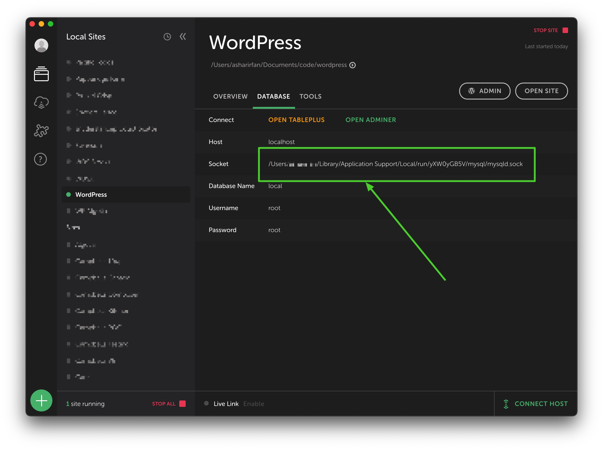

<div align="center">
	<p>A CLI to configure WP-CLI with the locally hosted websites of <a href="https://local.getflywheel.com/">Local by Flywheel</a></p>
	
	
	
</div>
<br>

> The CLI now works with Local Lightning! 🎉

## 🚀 Getting Started!

Use the following command to install `local-wpcli` globally.

```node
npm install -g local-wpcli
```

## ✅ Usage

To use `local-wpcli`,

1. Open terminal and go to the root of the website folder.<br>`cd ~/local-sites/wordpress/`
2. Type `local-wpcli` & press Enter (⏎).
3. Enter path to **Socket** file of the website & press Enter (⏎).

> 👉 *Note: You can find `Socket` in the `DATABASE` tab of the website in Local by Flywheel's desktop app. Please refer to the following screenshot below for help.*

4. At this point, you can run `wp` as you normally would.



## 🎩 License & Attribution

MIT &copy; [Ashar Irfan](https://asharirfan.com).

This project is inspired by [Create Guten Block](https://github.com/ahmadawais/create-guten-block).
